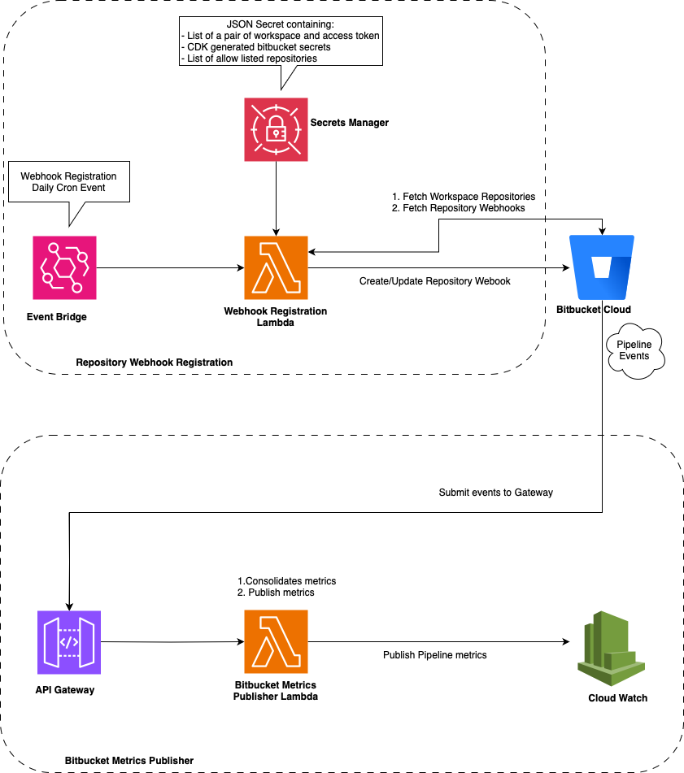

# BitBucket Metrics

Collect events from BitBucket Cloud and generates CloudWatch metrics

## How this works


## Build & Deploy

```bash
pnpm i --frozen-lockfile
pnpm build
cdk deploy
```

## This  project makes use of workspace tokens to access BitBucket Cloud API.
- Here is the link with the process of creating a workspace token: [Workspace tokens](https://support.atlassian.com/bitbucket-cloud/docs/app-passwords/)
- Once created, this token must be captured in the SCM Secrets Manager of the AWS account where the project will be deployed.

