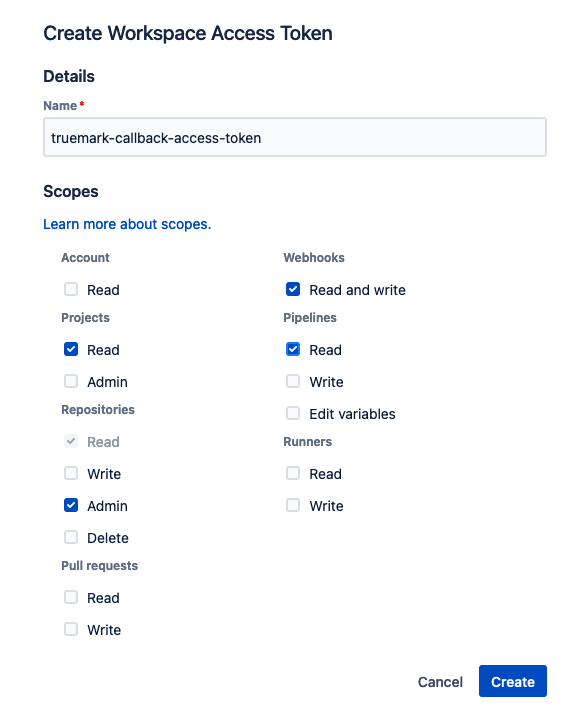

# BitBucket Metrics

Collect events from BitBucket Cloud and generates CloudWatch metrics

## How this works

## Build & Deploy

-   `pnpm build` compile typescript to js
-   `pnpm watch` watch for changes and compile
-   `pnpm test` perform the jest unit tests
-   `cdk deploy` deploy this stack to your default AWS account/region
-   `cdk diff` compare deployed stack with current state
-   `cdk synth` emits the synthesized CloudFormation template

## This  project makes use of workspace tokens to access BitBucket Cloud API.
#### Workspace Access Token Required Permissions

#### How to create a workspace token
- Here is the link with the process of creating a workspace token: [Workspace tokens](https://support.atlassian.com/bitbucket-cloud/docs/workspace-access-tokens/)
- Once created, this token must be captured in the SCM Secrets Manager of the AWS account where the project will be deployed.

